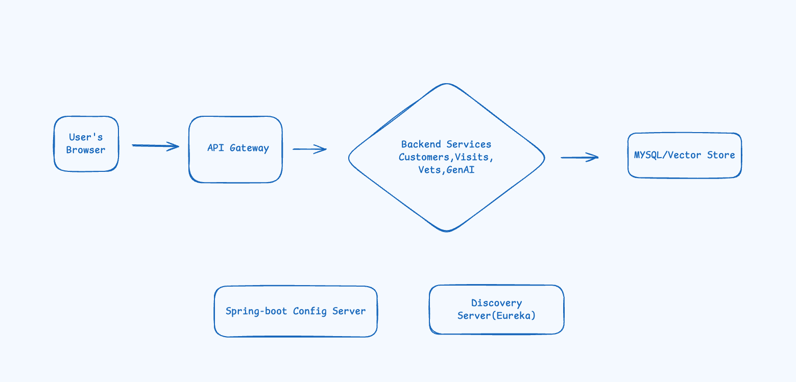
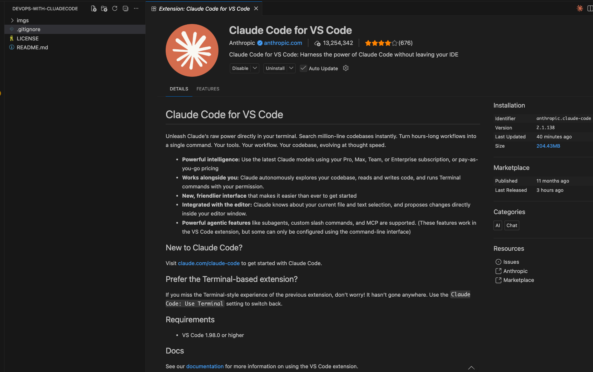

# DevOps with Claude Code

Deploy the [spring-petclinic-microservices](https://github.com/spring-petclinic/spring-petclinic-microservices) application on an Amazon EKS cluster using DevOps and infrastructure-as-code practices.

The [Micro-services-Architecture](https://github.com/spring-petclinic/spring-petclinic-microservices/blob/main/docs/microservices-architecture-diagram.jpg)


This project demonstrates how Claude Code can help accelerate cloud-native development, Kubernetes workflows, and deployment automation directly from VS Code. Amazon EKS is AWS’s managed Kubernetes service for running Kubernetes workloads at scale. 

## Overview

The goal of this project is to:
- Deploy Spring PetClinic microservices to Kubernetes on AWS EKS.
- Use repeatable and automated deployment workflows.
- Enable Claude Code inside VS Code for an AI-assisted development experience.

## Tech Stack

- Amazon EKS.
- Kubernetes.
- Spring PetClinic Microservices.
- VS Code.
- Claude Code.

## RequestFlow

[Application Request Flow](https://excalidraw.com/#json=2vBvj0bDs1sUuMdRNR1f6,kB54hDkL5nmK7AdEcblOWg)



## Claude Code in VS Code

Install and use the Claude Code extension in VS Code to get AI assistance directly in your editor, including plan review, inline diffs, and conversation history.



## Project Structure

```text
.
├── imgs/
│   └── claudecode_in_vscode.png
├── README.md
└── ...
```

## What’s Included

- EKS-based Kubernetes deployment.
- Microservices deployment for Spring PetClinic.
- Documentation and setup notes for Claude Code in VS Code.

## Getting Started

1. Clone the repository.
2. Prepare your AWS and Kubernetes environment.
3. Deploy the Spring PetClinic microservices to the EKS cluster.
4. Open the project in VS Code and enable Claude Code.

## References

- [Spring PetClinic Microservices](https://github.com/spring-petclinic/spring-petclinic-microservices)
- [Amazon EKS Documentation](https://docs.aws.amazon.com/eks/)
- [Claude Code for VS Code](https://code.claude.com/docs/en/vs-code)